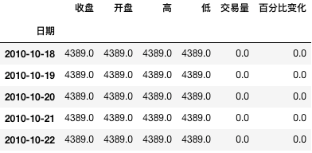

# 时间序列（Time Series）

## 时间序列：[WIKI](https://zh.wikipedia.org/wiki/%E6%99%82%E9%96%93%E5%BA%8F%E5%88%97)

**时间序列**（英语：time series）是一组按照时间发生先后顺序进行排列的数据点[序列](https://zh.wikipedia.org/wiki/%E5%BA%8F%E5%88%97)。通常一组时间序列的时间间隔为一恒定值（如1秒，5分钟，12小时，7天，1年），因此时间序列可以作为离散时间数据进行分析处理。

时间序列内容非常丰富，内容很多也很难；算是大学时比较难的几门数学课之一，不过这里不打算详细介绍这些冗长枯燥的理论，而是打算以一个例子介绍时间序列的建模

### 时间系列数据

说起时间序列的数据，最大名鼎鼎也最令人魂牵梦绕的数据就是量化交易的数据（股票、期货、数字货币等）

## ARCH模型

本节的主要目的是使用python实现ARCH模型，本节的原理部分主要摘抄自[这里](https://zhuanlan.zhihu.com/p/21962996)

### ARCH的基本原理

在传统计量经济学模型中，干扰项的方差被假设为常数。但是许多经济时间序列呈现出波动的集聚性，在这种情况下假设方差为常数是不恰当的。

ARCH模型将当前一切可利用信息作为条件，并采用某种自回归形式来刻划方差的变异，对于一个时间序列而言，在不同时刻可利用的信息不同，而相应的条件方差也不同，**利用ARCH 模型，可以刻划出随时间而变异的条件方差**。

#### ARCH模型思想

* 资产收益率序列的扰动 {} 是序列不相关的，但是不独立。
* {}的不独立性可以用其延迟值的简单二次函数来描述。具体而言，一个ARCH\(m\)模型为：

  

* 其中，{}为 **均值为0，方差为1的独立同分布（iid）随机变量序列。**通常假定其服从标准正态分布。为条件异方差。（注意区分：$$a_{t}$$和$$\alpha_t$$）

#### ARCH模型效应

从上面模型的结构看，大的过去的平方“扰动”会导致信息大的条件异方差。从而$$a_t$$有取绝对值较大的值的倾向。这意味着：**在ARCH的框架下，大的"扰动"会倾向于紧接着出现另一个大的"扰动"。这与波动率聚集的现象相似。**

所谓ARCH模型效应，也就是**条件异方差序列的序列相关性**

